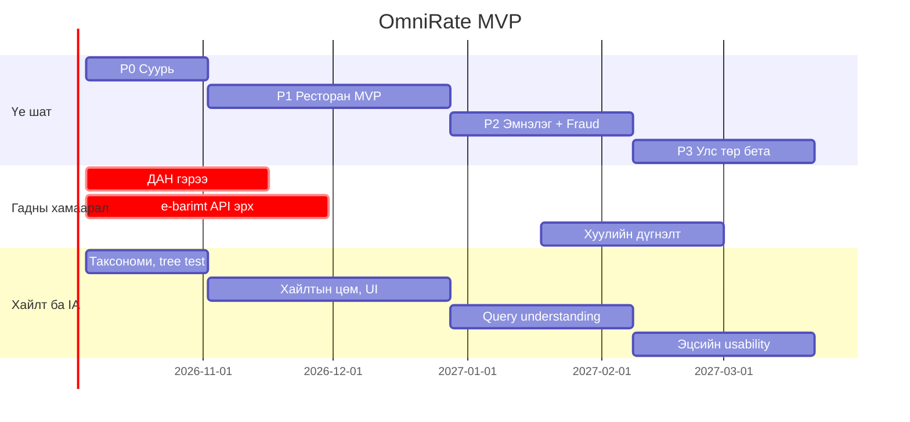

# OmniRate — Хэрэгжүүлэх ажлын нарийвчилсан даалгавар (Statement of Work) · v2

| Талбар | Утга |
|---|---|
| Төсөл | OmniRate: Polymorphic Rating & Proof-of-Experience Engine |
| Баримтын төрөл | Statement of Work (SOW), хувилбар 2 — хайлт ба мэдээллийн архитектурын шаардлага нэмэгдсэн |
| Хугацаа | 24 долоо хоног (2026-10-05 → 2027-03-19) |
| Баг | 7.5 FTE (6 хүн + Search engineer + 0.5 Product designer) |
| Нийт багтаамж | 900 хүн-өдөр (ХӨ) |
| Төлөвлөсөн ажил | ≈700 ХӨ |
| Нөөц | 22% |

---

## 0. v2 өөрчлөлтийн тэмдэглэл: шаардлагын нягтлал

**Шинэ шаардлага:** "Бүтээгдэхүүний хайлтын систем маш өндөр түвшинд ажиллаж, салбар салбараараа мэдээллийн 10/10 сайт шиг ойлгомжтой, эмх цэгцтэй байх."

**Дүгнэлт:** v1-д энэ шаардлага **тусгагдаагүй** байсан. Хайлт нь ганц даалгавар (P1-15, 6 ХӨ, pg_trgm) байсан бөгөөд мэдээллийн архитектур, UX дизайнер, хайлтын чанарын хэмжүүр огт байгаагүй.

| Шаардлагын бүрэлдэхүүн | v1 | v2-д шийдсэн байдал |
|---|---|---|
| Хайлтын хурд | Зөвхөн p95 ≤150 ms | K8, K9: autocomplete ≤80 ms, хайлт ≤150 ms @500 RPS |
| Хайлтын оновчтой байдал (relevance) | Байхгүй | K10: NDCG@10 ≥0.80, CI-д regression gate |
| Монгол хэлний онцлог (галиг, ө/ү, нөхцөл) | Байхгүй | K14: галиг/folding recall ≥95%, light stemmer, синоним ≥300 |
| Үр дүнгүй хайлт | Байхгүй | K11: zero-result ≤3%, "Та ... гэж хайсан уу?" |
| Салбараар эмх цэгцтэй бүтэц (IA) | Байхгүй | Салбар → Категори → Дэд категори таксономи, ≤3 товшилт (K15) |
| Шүүлтүүр (facet) | Байхгүй | JSON Schema-аас автоматаар үүсэх facet, 0 deploy |
| Ойлгомжтой байдал | Байхгүй | K12: 20 хэрэглэгч × 10 даалгавар, амжилт ≥90%, SUS ≥80 |
| Нэгэн жигд entity хуудас | Байхгүй | Салбар бүрт ижил дараалалтай загвар (`display` config) |
| Хүртээмж, SEO | Байхгүй | WCAG 2.2 AA, Core Web Vitals, schema.org |
| Хариуцах хүн | Байхгүй | Search engineer (1 FTE), Product designer (0.5 FTE) |

Нэмэгдсэн ажил: 20 даалгавар (S-01…S-20), +139 ХӨ; P1-15 хасагдав (−6 ХӨ).

---

## 1. Зорилго ба хамрах хүрээ

Энэ даалгаврын үр дүн нь Technical PRD-д заасан системийг production орчинд гаргаж, дараах 7 хэмжүүрийг баталгаажуулах явдал юм.

| # | Хүлээн авах хэмжүүр | Зорилт | Баталгаажуулах арга |
|---|---|---|---|
| K1 | `POST /reviews` p95 latency | ≤250 ms, 200 RPS-д | k6 load test, 30 мин |
| K2 | Entity унших p95 | ≤120 ms (cache hit), 1,000 RPS | k6 + Grafana |
| K3 | PoE ≥L2 үнэлгээний хувь | ≥70% | SQL тайлан, бетагийн эцэст |
| K4 | Бот бүртгэлийг хаах хувь | ≥99% (10,000 оролдлого) | Red-team дасгал |
| K5 | Review bombing илрүүлэх | ≥90%, ≤24 цагт | 300 хүний симуляц |
| K6 | Moderation false positive | ≤2% | 1,000 дээжийн gold set |
| K7 | Шинэ категори нэмэх | 0 deploy, ≤15 мин (facet, хуудас автоматаар үүснэ) | Хөгжүүлэгч биш хүн гүйцэтгэнэ |
| K8 | Autocomplete p95 latency | ≤80 ms | k6, 500 RPS |
| K9 | Хайлтын үр дүн p95 latency | ≤150 ms, 500 RPS, facet тооллоготой | k6 + OpenSearch slow log |
| K10 | Хайлтын оновчтой байдал | NDCG@10 ≥0.80 | 500 асуулгын тэмдэглэсэн gold set |
| K11 | Үр дүнгүй хайлтын хувь | ≤3% | Хайлтын лог, долоо хоног бүр |
| K12 | Ойлгомжтой байдал | Даалгаврын амжилт ≥90%, медиан ≤20 s, SUS ≥80 | 20 хэрэглэгч × 10 даалгавар |
| K13 | Индексийн шинэчлэл | Нийтлэгдсэнээс ≤60 s (p95) | CDC lag metric |
| K14 | Галиг / ө-ү folding recall | ≥95% | 300 асуулгын тест ("hool" → "хоол", "urgoo" → "өргөө") |
| K15 | Бүтцийн хүртээмж | Entity бүр нүүрнээс ≤3 товшилтоор; WCAG 2.2 AA critical алдаа 0 | Tree test + axe-core |

**Хамрахгүй:** төлбөрийн систем, зар сурталчилгаа, олон хэл (зөвхөн монгол), iOS/Android-аас бусад платформ.

---

## 2. Баг ба хариуцлага

| Код | Үүрэг | Үндсэн хариуцлага | Багтаамж (ХӨ) |
|---|---|---|---|
| BE1 | Backend lead | Domain logic, schema registry, PoE, оноо | 120 |
| BE2 | Backend / Platform | Infra, auth, queue, CDC, аюулгүй байдал | 120 |
| FE | Frontend | Web, admin UI, moderator UI | 120 |
| MOB | Mobile | React Native, GPS, attestation, QR scanner | 120 |
| ML | ML engineer | OCR, classifier, LLM, fraud model | 120 |
| PM | PM / QA | Төлөвлөлт, тест, пилот, хуулийн уялдаа | 120 |
| SRCH | Search engineer | OpenSearch, анализатор, ranking, relevance хэмжилт | 120 |
| DS | Product designer (0.5 FTE) | Мэдээллийн архитектур, design system, usability тест | 60 |
| EXT | Гадны | Хуульч (≈15 өдөр), pentester (≈10 өдөр), тэмдэглэгээчид (15,000 дээж) | — |

---

## 3. Ажлын стандарт

### 3.1 Definition of Ready (даалгавар эхлэхийн өмнө)

- Хүлээн авах шалгуур тоогоор бичигдсэн.
- Хамаарал шийдэгдсэн.
- Estimate ≤5 ХӨ (томыг задална).

### 3.2 Definition of Done

- Unit + integration test coverage ≥80% (шинэ кодод), mutation score ≥60% (оноо тооцох модульд).
- CI бүрэн ажиллах хугацаа ≤10 мин; main branch-д 1 хүний code review заавал.
- OpenTelemetry trace ба Grafana панел нэмэгдсэн.
- Хувь хүний мэдээлэлд хүрдэг бол PM + хуульчийн checklist тэмдэглэгдсэн.
- Stage орчинд deploy хийгдэж, хүлээн авах шалгуур демо-гоор батлагдсан.
- Хайлт, ranking, анализаторт хүрсэн өөрчлөлт: gold set дээр NDCG@10 0.02-оос илүү буурвал CI merge-ийг хаана.
- UI өөрчлөлт: design system-ийн компонент ашигласан, axe-core critical алдаа 0.

### 3.3 Хэмнэл

- 2 долоо хоногийн sprint.
- Даваа гаригт 30 мин төлөвлөлт, баасанд демо.
- Үе шат бүрийн төгсгөлд Go/No-Go хурал.

---

## 4. Хуваарь



**Критик зам:** ДАН гэрээ → P0-07 (Auth) → P1 бүх PoE ажил. ДАН гэрээ 6 долоо хоногт ирэхгүй бол L1 (OTP) горимоор пилот эхэлж, L2-ыг P2 руу шилжүүлнэ.

---

## 5. Хайлт ба мэдээллийн архитектурын шийдэл

### 5.1 Мэдээллийн архитектур (салбарын бүтэц)

Бүтэц нь 3 түвшнээс хэтрэхгүй, түвшин бүрт ≤12 зүйлтэй. Байршлын бүтэц (аймаг/хот → сум/дүүрэг → баг/хороо) нь салбарын бүтэцтэй зэрэгцэн шүүлтүүр болж ажиллана.

| Салбар | Категори (жишээ) | Дэд категори / facet (жишээ) |
|---|---|---|
| Хоол, зоог | Ресторан, кафе, түргэн хоол | Хоолны төрөл, үнийн түвшин, хүргэлт |
| Эрүүл мэнд | Эмнэлэг, шүдний эмнэлэг, эмийн сан | Төрөл (улсын/хувийн), мэргэшил, даатгал |
| Боловсрол | Сургууль, цэцэрлэг, их сургууль | Өмчийн хэлбэр, хичээлийн хэл, анги |
| Төрийн алба | УИХ-ын гишүүн, ИТХ, засаг дарга | Тойрог, нам, бүрэн эрхийн хугацаа |

URL бүтэц (латин slug): `/{салбар}/{категори}/{байршил}/{entity}` — жишээ: `/eruul-mend/emneleg/ulaanbaatar/khan-uul/intermed`. Хуудас бүр breadcrumb-тай.

Салбарын нүүр хуудас бүр ижил 5 блоктой: (1) хайлтын мөр, (2) категориуд, (3) "Хамгийн олон баталгаажсан үнэлгээтэй", (4) "Ойролцоо", (5) шинээр нэмэгдсэн.

### 5.2 Schema-аас автоматаар үүсэх facet ба хуудас

Шинэ категори нэмэхэд шүүлтүүр, entity хуудасны бүтэц `category_schemas` дотор тодорхойлогдож, код өөрчлөхгүй үүснэ:

```json
{
  "search": {
    "facets": [
      { "field": "cuisine",    "type": "multi",  "label_mn": "Хоолны төрөл", "order": 1 },
      { "field": "price_band", "type": "range",  "label_mn": "Үнийн түвшин", "order": 2 },
      { "field": "delivery",   "type": "bool",   "label_mn": "Хүргэлттэй",   "order": 3 }
    ],
    "synonyms": ["ресторан, зоогийн газар", "кафе, кофе шоп"],
    "default_sort": "relevance"
  },
  "display": {
    "sections": ["summary", "criteria_breakdown", "reviews", "attributes", "map", "owner_reply"]
  }
}
```

Entity хуудас бүх салбарт ижил дараалалтай: нэр, салбар/категори, баталгаажсан badge → нийт оноо ба PoE түвшнээр задарсан үнэлгээний тоо → шалгуур бүрийн оноо → үнэлгээнүүд (PoE түвшин, огноо, оноогоор шүүх) → мэдээлэл → газрын зураг → эзэмшигчийн хариу.

### 5.3 Хайлтын технологи ба Монгол хэлний боловсруулалт

- **Engine:** OpenSearch 2.x, 3 node (1 node унасан үед K9 хэвээр), PostgreSQL → Debezium CDC → indexer (K13).
- **Талбарууд:** `name` (кирилл), `name_folded` (ө→о, ү→у, ё→е), `name_translit` (латин галиг), `name_edge` (autocomplete edge n-gram 2–15).
- **Галиг:** хэрэглэгчийн латин оруулгыг (`hool`, `sh`, `ts`, `kh`, `u/ü`) кирилл хувилбарууд руу хөрвүүлж, OR асуулга үүсгэнэ.
- **Нөхцөл залгавар:** light stemmer (-ын/-ийн/-ний, -д/-т, -аас/-ээс/-оос/-өөс, -тай/-тэй/-той г.м), gold set дээр recall ба precision-ийг хэмжиж батална.
- **Үсгийн алдаа:** ≤5 тэмдэгтэд 1 засвар, >5-д 2 засвар (fuzziness AUTO).
- **Синоним ба товчлол:** ≥300 бичлэг ("ШУТИС", "УНТЭ", "поликлиник → эмнэлэг"), admin UI-аас засна.

### 5.4 Эрэмбэлэлт (ranking)

```
score = 0.45·BM25_norm + 0.20·Bayes_norm + 0.15·log(1+N_verified)/log(1+N_max)
      + 0.12·exp(−d / 2 км) + 0.08·freshness
```

- Жинг gold set дээр NDCG@10-оор тохируулна. ≥20,000 click лог хуримтлагдсаны дараа Learning-to-Rank (LambdaMART) руу шилжинэ.
- Зөвхөн PoE жин ба fraud-аар засагдсан оноо ranking-д орно; үнэлгээний тооны нөлөө `log`-оор хязгаарлагдана (review bombing ranking-д шууд нөлөөлөхгүй).
- Төрийн албан тушаалтны хайлтын анхдагч эрэмбэ: тойрог → нэр. Оноогоор эрэмбэлэх нь зөвхөн хэрэглэгч сонговол; төлбөртэй байрлал бүх салбарт 0.

---

## 6. Даалгаврын задаргаа

### P0 — Суурь (7 хоног 1–4) · ≈146 ХӨ

**Гарах шалгуур:** K7 биелэх; 200 RPS-д K1 биелэх; ДАН sandbox-оор нэвтрэх ажиллах; таксономийн tree test амжилт ≥80%.

| ID | Даалгавар | Эзэн | ХӨ | Хамаарал | Хүлээн авах шалгуур |
|---|---|---|---|---|---|
| P0-01 | Monorepo, CI/CD (GitHub Actions), dev/stage/prod орчин | BE2 | 6 | — | PR merge → stage deploy ≤10 мин; main хамгаалалттай |
| P0-02 | Terraform: PostgreSQL 16 + PostGIS + pg_jsonschema, Redis 7, object storage | BE2 | 8 | P0-01 | Хоосноос орчин үүсгэх ≤30 мин; PITR restore дасгал RTO ≤30 мин |
| P0-03 | Observability: OTel, Prometheus, Grafana, Sentry | BE2 | 4 | P0-02 | PRD-ийн бүх SLO панелтай; p95 >250 ms 5 мин үргэлжилбэл alert |
| P0-04 | Alembic migration: 6 үндсэн хүснэгт + `audit_log` | BE1 | 5 | P0-02 | Буруу `attributes` DB түвшинд CHECK-ээр татгалзагдах тест |
| P0-05 | Schema registry: publish, version, validate | BE1 | 8 | P0-04 | Нийтлэгдсэн хувилбар өөрчлөгдөхгүй (409); буруу JSON Schema татгалзагдах |
| P0-06 | Entities/Reviews CRUD, idempotency key | BE1 | 10 | P0-05 | K1 биелэх; давхар үнэлгээнд 409 |
| P0-07 | ДАН OAuth2 + PKCE, РД HMAC-SHA256, JWT, OTP | BE2 | 12 | ДАН гэрээ | 1 РД = 1 хаяг; DB бүрэн scan-д түүхий РД 0 мөр |
| P0-08 | Gateway rate limit (PRD хүснэгтээр) | BE2 | 4 | P0-07 | k6-оор босго бүрт 429 ±1% нарийвчлалтай |
| P0-09 | Admin UI: категори, schema editor, entity удирдлага | FE | 12 | P0-05 | Хөгжүүлэгч биш хүн категори ≤15 минутад нэмэх (K7) |
| P0-10 | JSON Schema → форм renderer (`@rjsf/core`) | FE | 6 | P0-05 | 3 категорийн schema-г код өөрчлөхгүй render хийх |
| P0-11 | Mobile skeleton (Expo), auth, Play Integrity / App Attest | MOB | 12 | P0-07 | Root/jailbreak төхөөрөмж attestation-д унах |
| P0-12 | Moderation dataset: 15,000 монгол текст тэмдэглэх | ML + EXT | 15 | — | Тэмдэглэгчдийн Cohen's kappa ≥0.75 |
| P0-13 | Тестийн стратеги, k6 harness, 10M мөрийн test data generator | PM | 8 | P0-04 | Генератор 10M мөрийг ≤20 минутад үүсгэх |
| P0-14 | DPIA, зөвшөөрлийн текст, хуульчтай гэрээ | PM + EXT | 5 | — | Хуульчийн гарын үсэгтэй DPIA v1 |
| S-01 | Таксономи: card sorting (30 хэрэглэгч), tree testing, sitemap | DS | 8 | — | Tree test амжилт ≥80%; түвшин ≤3, түвшин бүрт ≤12 зүйл |
| S-02 | Design system: token, entity card, facet panel, breadcrumb | DS + FE | 10 | S-01 | Бүх компонент light/dark, WCAG 2.2 AA контраст ≥4.5:1 |
| S-03 | OpenSearch 3 node (Terraform) + CDC indexer | SRCH | 8 | P0-02 | K13 ≤60 s; 1 node унтраахад алдаа 0 |
| S-04 | `search` ба `display` config-ийг schema registry-д нэмэх, validation | BE1 + SRCH | 5 | P0-05 | Шинэ категорид facet ба хуудас 0 deploy-оор үүсэх (K7) |

### P1 — Ресторан MVP (7 хоног 5–12) · ≈252 ХӨ

**Гарах шалгуур:** 50 ресторан, 2,000 L2 хэрэглэгч; PoE ≥L3 хувь ≥50%; pentest-ийн Critical/High алдаа 0; K8, K13, K14 биелэх; NDCG@10 ≥0.75.

| ID | Даалгавар | Эзэн | ХӨ | Хамаарал | Хүлээн авах шалгуур |
|---|---|---|---|---|---|
| P1-01 | e-barimt QR задлах + баталгаажуулах API | BE1 | 10 | e-barimt эрх | ТТД match, ≤90 хоног, ДДТД UNIQUE; татгалзалт бүр шалтгааны кодтой |
| P1-02 | Зураг upload (presigned URL, ≤10 MB, EXIF устгах) | BE2 | 5 | P0-02 | EXIF GPS хадгалагдсан файл 0 |
| P1-03 | OCR pipeline (PaddleOCR кирилл) + талбар задлах | ML | 15 | P1-02 | 500 баримтын тест дээр талбарын нарийвчлал ≥90%; p95 ≤8 s |
| P1-04 | pHash давхардал + ELA forensic | ML | 6 | P1-03 | Давхардал илрүүлэх ≥95%, FP ≤2% |
| P1-05 | PoE түвшин/жин тооцох engine | BE1 | 6 | P1-01 | PRD-ийн L0–L4 хүснэгтийн 100% тест кейс давах |
| P1-06 | Queue + worker (Redis Streams, Arq), DLQ, retry | BE2 | 6 | P0-02 | Idempotent боловсруулалт; DLQ >10 мессежэд alert |
| P1-07 | Moderation шат 1: PII regex (РД, утас, имэйл) | ML | 4 | P0-12 | PII recall ≥99% тестийн багц дээр |
| P1-08 | XLM-R classifier fine-tune | ML | 15 | P0-12 | Toxicity F1 ≥0.88; CPU inference ≤40 ms |
| P1-09 | Bayesian trimmed оноо, Redis-д материалжуулах | BE1 | 6 | P1-05 | Лавлах Python хэрэгжүүлэлттэй 4 оронгийн нарийвчлалаар таарах |
| P1-10 | Entity хуудас (SSR), шалгуурын задаргаа | FE | 12 | P1-09 | 4G-д LCP ≤2.5 s; Lighthouse ≥90 |
| P1-11 | Web: үнэлгээ илгээх урсгал + баримт upload | FE | 10 | P0-10 | Илгээлт ≤4 алхамд дуусах |
| P1-12 | Mobile: үнэлгээ, e-barimt QR scanner, баримтын камер | MOB | 20 | P0-11 | QR уншилт ≤2 s, амжилт ≥95% (100 бодит баримт) |
| P1-13 | Эзэмшигчийн claim + хариу бичих | BE2 + FE | 8 | P0-07 | ТТД таараагүй claim 100% татгалзагдах |
| P1-14 | Гомдлын endpoint (суурь) | BE2 | 3 | P0-06 | Rate limit хүснэгтээр ажиллах |
| P1-15 | *(Хасагдсан — S-05…S-13-аар орлуулав)* | — | 0 | — | — |
| P1-16 | Пилот: 50 ресторан, 2,000 хэрэглэгч татах | PM | 15 | P1-12 | Гарах шалгуурын тоо биелэх |
| P1-17 | E2E тест (Playwright web, Detox mobile) | PM | 12 | P1-11 | Критик 20 урсгал CI-д ажиллах |
| P1-18 | OWASP ASVS L2 checklist + гадны pentest | PM + EXT | 5 | P1-13 | Critical/High алдаа 0 |
| S-05 | Монгол анализатор: ө/ү folding, латин↔кирилл галиг, light stemmer, синоним ≥300 | SRCH + ML | 12 | S-03 | K14 ≥95% (300 асуулга) |
| S-06 | Autocomplete: entity, категори, байршил (edge n-gram + completion) | SRCH | 6 | S-05 | K8 ≤80 ms; эхний 3 тэмдэгтээс санал гарах |
| S-07 | Ranking v1 (5.4 томьёо) | SRCH | 5 | P1-09 | Gold set дээр NDCG@10 ≥0.75 |
| S-08 | Gold set: 500 асуулга, 3 түвшний тэмдэглэгээ; NDCG harness CI-д | SRCH + PM | 8 | S-03 | Тэмдэглэгчдийн kappa ≥0.7; CI gate ажиллах |
| S-09 | Хайлтын үр дүнгийн хуудас: facet, эрэмбэ, жагсаалт/газрын зураг | FE | 12 | S-02 | Facet тооллого 100% зөв; 4G-д LCP ≤2.5 s |
| S-10 | Салбар/категорийн нүүр хуудас, breadcrumb, URL бүтэц | FE + DS | 10 | S-01 | Entity бүр ≤3 товшилтоор хүрэгдэх (K15) |
| S-11 | Нэгэн жигд entity хуудасны загвар (`display` config) | FE + DS | 6 | S-04 | 3 категорид ижил дараалал, код салаалалт 0 |
| S-12 | SEO: SSR, sitemap.xml, schema.org (LocalBusiness, Hospital, School) | FE | 5 | S-10 | Core Web Vitals "Good" ≥90% URL; Rich Results Test алдаа 0 |
| S-13 | Хайлтын аналитик: лог, zero-result, CTR dashboard | SRCH | 4 | S-06 | Хэмжүүр 15 минутын хоцролттой харагдах |

### P2 — Эмнэлэг ба Anti-fraud (7 хоног 13–18) · ≈174 ХӨ

**Гарах шалгуур:** K4, K5, K6 биелэх; LLM prompt injection red-team давах ≤3%; K10, K11 биелэх; usability 1-р шатны амжилт ≥85%.

| ID | Даалгавар | Эзэн | ХӨ | Хамаарал | Хүлээн авах шалгуур |
|---|---|---|---|---|---|
| P2-01 | GPS geofence: полигон, background location, dwell тооцоо | MOB + BE1 | 18 | P1-12 | 50 бодит айлчлал дээр dwell алдаа ±2 мин; батарей ≤3%/өдөр |
| P2-02 | Mock location, хурдны үсрэлт (>150 км/ц) илрүүлэх | MOB + BE1 | 6 | P2-01 | Mock app-ын 5 төрлийг 100% илрүүлэх |
| P2-03 | Эмнэлгийн QR: Ed25519 түлхүүр, 72 цагийн JWT, хэвлэх PDF | BE2 | 8 | P1-05 | Хугацаа дууссан, давхар `jti` 100% татгалзагдах |
| P2-04 | Эрүүл мэндийн PII redaction (онош, эмийн толь) | ML | 5 | P1-07 | Recall ≥97% 500 дээж дээр |
| P2-05 | LLM moderation worker: prompt, JSON schema, fallback, зардлын хяналт | ML + BE1 | 11 | P1-06 | Шинжээчтэй санал нийлэх ≥85% (1,000 gold set); injection ≤3% |
| P2-06 | Засах санал (rewrite) UX | FE | 4 | P2-05 | Санал хүлээн авсан хувийг хэмжих event |
| P2-07 | Debezium CDC → Parquet → DuckDB (15 мин) | BE2 | 10 | P0-02 | Lag ≤15 мин; 100M мөрийн агрегат ≤10 s |
| P2-08 | LightGBM fraud загвар + синтетик дайралтын өгөгдөл | ML | 12 | P2-07 | AUC ≥0.93; 0.7 босгонд precision ≥0.90 |
| P2-09 | Louvain graph job | ML | 5 | P2-07 | 1M ирмэг ≤5 мин |
| P2-10 | Embedding төстэй байдал (e5 + pgvector) | ML + BE1 | 6 | P1-06 | cosine ≥0.92 кластер илрүүлэх, 1 үнэлгээ ≤200 ms |
| P2-11 | Surge mode | BE1 | 5 | P2-08 | z-score >4-т ≤5 мин дотор асах |
| P2-12 | Хүний шалгалтын дараалал, 2 moderator урсгал | FE + BE2 | 14 | P2-05 | Кейс нэг бүрийн шийдвэрлэх медиан хугацаа ≤3 мин |
| P2-13 | Device binding, шинэ төхөөрөмжийн 7 хоногийн cooldown | BE2 | 4 | P0-11 | Impossible travel тест кейс 100% барих |
| P2-14 | Red-team дасгал: 10,000 бот, 300 хүний bombing | PM + бүгд | 10 | P2-01…P2-13 | K4, K5 биелэх, тайлан гарах |
| S-14 | Query understanding: байршил, категори таних ("Хан-Уул дахь солонгос ресторан") | SRCH + ML | 8 | S-05 | 300 асуулга дээр задлалтын нарийвчлал ≥90% |
| S-15 | Zero-result fallback: "Та ... гэж хайсан уу?", сулруулсан асуулга, ойролцоо санал | SRCH | 5 | S-13 | K11 ≤3% |
| S-16 | Usability тест 1-р шат (20 хэрэглэгч × 10 даалгавар) ба засвар | DS + PM | 8 | S-09 | Амжилт ≥85%; олдсон critical асуудал 100% засагдах |
| S-17 | Ranking-ийн эсрэг манипуляц: fraud-жинтэй дохио, тооны нөлөөний хязгаар | SRCH | 3 | P2-08 | Симуляцлагдсан bombing-оор байр ≤2 шатлалаас илүү өөрчлөгдөхгүй |

### P3 — Улс төрийн хаалттай бета (7 хоног 19–24) · ≈126 ХӨ

**Гарах шалгуур:** гомдлын SLA ≥95%; хуульчийн эцсийн дүгнэлт; K2-ыг 1,000 RPS-д биелүүлэх; DR дасгал амжилттай; K9, K12, K15 биелэх.

| ID | Даалгавар | Эзэн | ХӨ | Хамаарал | Хүлээн авах шалгуур |
|---|---|---|---|---|---|
| P3-01 | Хороо → тойргийн mapping, хувилбартай импорт | BE1 | 5 | P0-07 | Хорооны 100% тойрогт map хийгдэх |
| P3-02 | `jurisdiction_match` ба тусгаарласан оноо | BE1 + FE | 9 | P3-01 | 2 төрлийн дундаж тусдаа харагдах |
| P3-03 | Улс төрчийн schema + ирцийн объектив өгөгдөл импорт | BE2 | 6 | Өгөгдлийн эх сурвалж | Өдөр бүр шинэчлэгдэх, алдаа alert-тэй |
| P3-04 | `strict_defamation` moderation горим | ML | 6 | P2-05 | Эх сурвалжгүй `criminal_allegation` нийтлэгдэх 0 (500 тест) |
| P3-05 | Notice-and-takedown урсгал, SLA таймер, hash-chain audit log | BE2 + FE | 14 | P2-12 | Audit log-ийн мөрийг өөрчлөх оролдлого илрэх 100% |
| P3-06 | Хууль сахиулах байгууллагын хүсэлтийн портал | BE2 | 3 | P3-05 | ≤4 цагийн SLA таймер ажиллах |
| P3-07 | Сарын ил тод байдлын тайлан (автомат) | BE1 | 3 | P2-07 | Устгасан, сэргээсэн, гомдлын тоо гарах |
| P3-08 | Moderator сургалт, playbook | PM | 5 | P3-04 | 4 moderator шалгалтад ≥90% оноо |
| P3-09 | Хуульчийн эцсийн хяналт | PM + EXT | 5 | P3-05 | Бичгээр дүгнэлт |
| P3-10 | Хаалттай бета: 2 тойрог, 1,000 хэрэглэгч | PM | 10 | P3-02 | K3 ≥70% |
| P3-11 | Load test: 1,000 RPS унших, 200 RPS бичих | PM | 5 | Бүгд | K1, K2 биелэх |
| P3-12 | DR дасгал | BE2 | 2 | P0-02 | RPO ≤5 мин, RTO ≤30 мин |
| S-18 | Төрийн албаны хайлт: тойргийн газрын зургаар үзэх, төвийг сахисан анхдагч эрэмбэ | FE + SRCH | 6 | P3-01 | 100% тойрог газрын зургаас хүрэгдэх; оноогоор анхдагч эрэмбэ 0 |
| S-19 | Хайлтын load test 500 RPS + 1 node failover | SRCH + PM | 4 | S-15 | K8, K9 биелэх, failover үед алдаа ≤0.1% |
| S-20 | Эцсийн usability тест + WCAG 2.2 AA аудит | DS + PM | 6 | S-18 | K12, K15 биелэх |

---

## 7. Эрсдэл ба хариу арга хэмжээ

| Эрсдэл | Магадлал | Нөлөө | Хариу |
|---|---|---|---|
| ДАН гэрээ хоцрох | Өндөр | Критик замыг 4–8 долоо хоног хойшлуулна | L1 горимоор пилот; Go/No-Go-д шилжүүлэх |
| e-barimt API эрх олгогдохгүй | Дунд | L3 нотолгооны 1 суваг алга | OCR + GPS-ээр нөхөх, жинг 0.70 хэвээр |
| Монгол хэлний өгөгдөл хүрэлцэхгүй | Дунд | F1 <0.88 | LLM-ээр синтетик 5,000 дээж, гар шалгалттай |
| LLM зардал төсвөөс хэтрэх | Бага | Сард >$500 | Classifier босгыг 0.93 болгож LLM урсгалыг ≤30% болгох |
| Хуулийн дүгнэлт сөрөг | Дунд | P3 зогсох | Улс төрийн категорийг зөвхөн объектив шалгуураар нээх |
| Монгол stemmer precision-ийг бууруулах | Дунд | NDCG <0.80 | Stemmed ба stemmed бус талбарыг хослуулж, жинг gold set-ээр тохируулах |
| Gold set-ийн асуулга бодит хэрэглээг төлөөлөхгүй | Дунд | K10 бодит байдалтай зөрөх | P2-оос бодит логоос 200 асуулгаар сар бүр шинэчлэх |
| FE ачаалал ≈95% | Өндөр | P1 хоцрох | DS прототипийг шууд компонент болгох; S-12-ыг P2 руу шилжүүлэх боломж |

---

## 8. Тайлагнал ба хүлээлгэн өгөх зүйлс

### 8.1 Тайлагнал

- **Долоо хоног бүр:** burndown, 15 хүлээн авах хэмжүүрийн одоогийн утга, блоклогдсон даалгавар, хайлтын zero-result top 20 асуулга.
- **Үе шат бүрийн төгсгөлд:** Go/No-Go хурал (PM, BE1, ML, захиалагч). Шалгуур биелээгүй бол ≤2 долоо хоногийн hardening sprint хийж, хуваарь тэр хэмжээгээр шилжинэ.

### 8.2 Эцсийн хүлээлгэн өгөх зүйлс

- [ ] Эх код (monorepo)
- [ ] Terraform ба орчны тохиргоо
- [ ] Runbook (incident, DR, deploy)
- [ ] API баримт (OpenAPI 3.1)
- [ ] Moderator playbook
- [ ] Red-team тайлан
- [ ] Pentest тайлан
- [ ] Хуульчийн дүгнэлт
- [ ] Таксономи, sitemap, tree test тайлан
- [ ] Design system (Figma + React компонент сан)
- [ ] Хайлтын relevance тайлан (gold set, NDCG түүх, синоним толь)
- [ ] Usability тестийн 2 шатны тайлан

---

> **Тэмдэглэл:** Хугацаа ба ХӨ нь 7.5 FTE багийн жишиг тооцоо бөгөөд ДАН, e-barimt-ийн гэрээний хугацаанаас хамгийн их хамаарна. Хуулийн холбогдолтой хэсгүүдийг заавал Монгол Улсын хуульчаар батлуулна.
